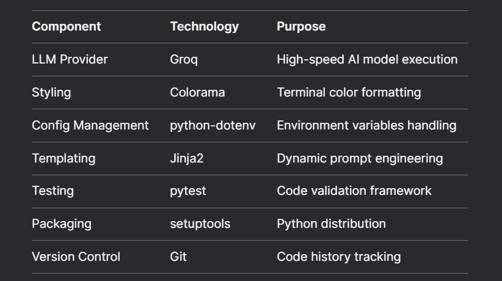
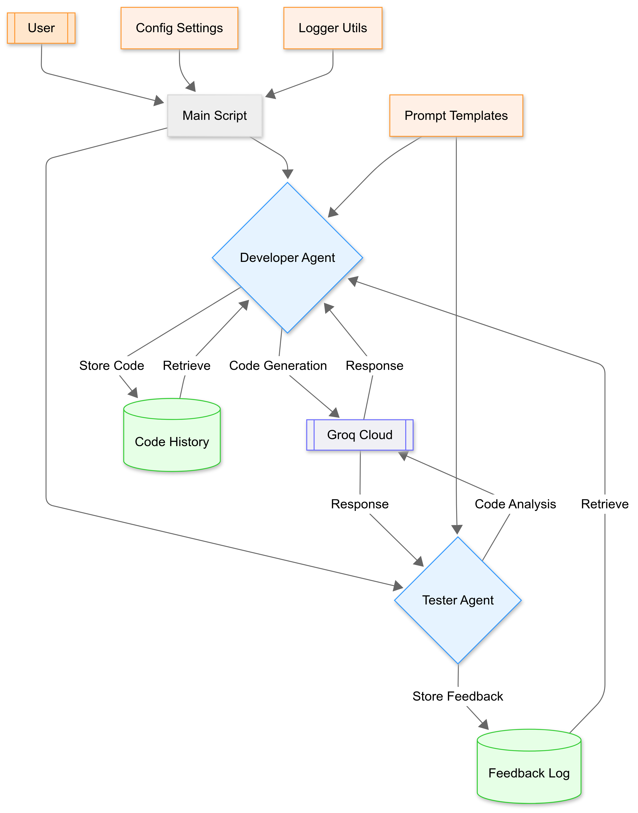

# Hands-On Lets Learn Reflection AI Agent Pattern By Building It

Hands-On: Let’s Learn Reflection AI Agent Pattern By Building It

## TL;DR
This article is all about building AI developer-tester duos that work together to improve code quality. I’ll walk you through a real code example, complete with visual feedback and iterative refinement, to show you how it’s done.

## Introduction:
Imagine having two AI coworkers: one writes code, and the other critiques it. They debate, improve, and repeat the process until the code is as polished as it can be. I built this system using open-source tools to automate the process of producing high-quality code. Here’s a deep dive into how it works and why it’s so important.

## What’s This Article About?
This guide is all about creating AI agents that mimic the dynamics between human developers and testers. You’ll get to see actual Python code where:

- Developer AI writes new features.
- Tester AI finds flaws and suggests improvements.
- Both agents loop through this process until the code is perfect.

To make it relatable, I used a fictional tech company example called “CodeCraft Inc.” We’ll implement this system for algorithm development, showcasing:

- Role-specific prompts: Each AI has its own set of instructions tailored to its role.
- Feedback integration: The tester AI provides feedback that the developer AI uses to improve the code.
- Progress visualization: You can see the progress in real-time with clear visual indicators.
- Early quality checks: The system stops iterating as soon as the code meets the quality threshold.

Full Article : [https://medium.com/@learn-simplified/how-i-made-developer-tester-ai-agents-fix-their-work-63077dc4ae7a


## Tech Stack  




## Architecture




# Tutorial: Hands-On Lets Learn Reflection AI Agent Pattern By Building It

## Prerequisites
- Python installed on your system.
- A basic understanding of virtual environments and command-line tools.

## Steps

1. **Virtual Environment Setup:**
   - Create a dedicated virtual environment for our project:
   
     ```bash
     python -m venv Hands-On-Lets-Learn-Reflection-AI-Agent-Pattern-By-Building-It
     ```
   - Activate the environment:
   
     - Windows:
       ```bash
          Hands-On-Lets-Learn-Reflection-AI-Agent-Pattern-By-Building-It\Scripts\activate        
       ```
     - Unix/macOS:
       ```bash
       source Hands-On-Lets-Learn-Reflection-AI-Agent-Pattern-By-Building-It/bin/activate
       ```
   

# Installation and Setup Guide

**Install Project Dependencies:**

Follow these steps to set up and run the  "Hands-On Lets Learn Reflection AI Agent Pattern By Building It"

1. Navigate to your project directory:
   ```
   cd path/to/your/project
   ```
   This ensures you're in the correct location for the subsequent steps.

2. Install the required dependencies:
   ```
   pip install -r requirements.txt   
   ```
   This command installs all the necessary Python packages listed in the requirements.txt file.


# Run - Hands-On Guide: Hands-On Lets Learn Reflection AI Agent Pattern By Building It
  
   ```
   python Main.py   
   ```
   
## Closing Thoughts

Within the next two years, AI agents are expected to handle 80% of routine coding tasks, according to Gartner. The core idea behind this system — specialized AIs collaborating — will expand to other fields like:

Legal document drafting: Writer bots and reviewer bots working together.
Architecture design: Designer sims and engineer sims collaborating on blueprints.
Medical diagnosis: Symptom checker bots and treatment validator bots ensuring accurate diagnoses.
The future belongs to AI teams working like expert committees, constantly improving and refining their output. It’s an exciting time to be in tech, and this system is just the beginning of what’s possible.